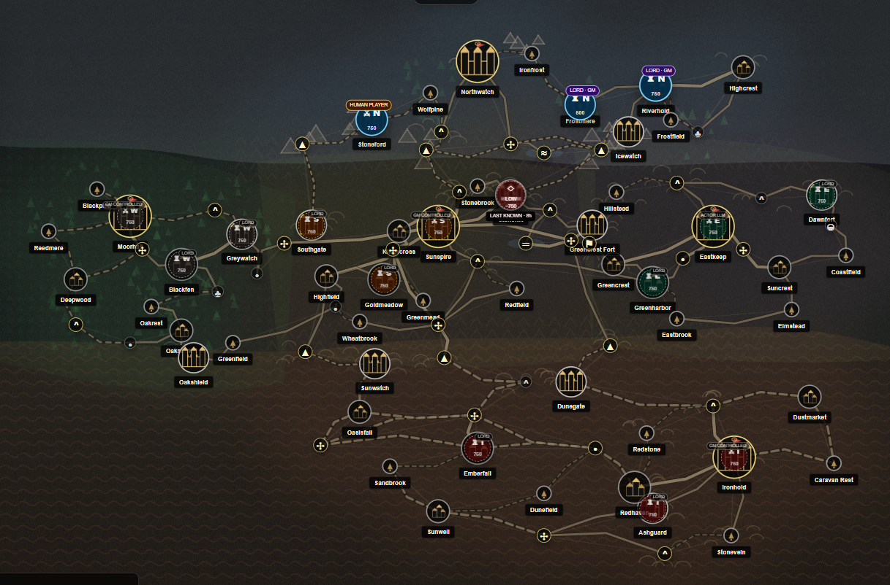
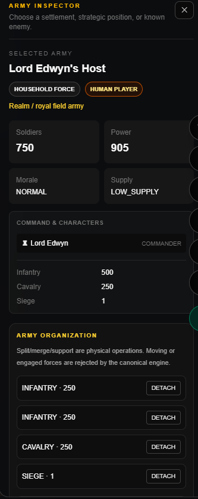
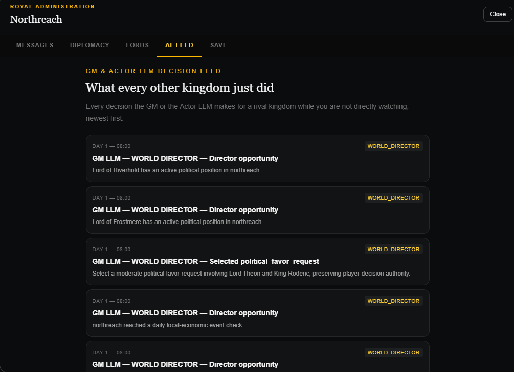

# War of the Five Kingdoms — a living, WebMCP-native strategy realm

A persistent, real-time strategy kingdom simulator built for ChatGPT Apps / WebMCP. Five rival kingdoms — armies, lords, diplomacy, economy, and a living world clock — run continuously in one canonical world state, playable either as a full visual strategy game in the browser, or entirely through natural-language MCP tool calls from inside ChatGPT.





*(Drop screenshots into `docs/screenshots/` using the filenames above and they will render here automatically.)*

## The pitch, in one paragraph

Most "AI game" demos are a chatbot narrating a static scene from turn to turn. This is a real, continuously running simulation with a single source of truth: five kingdoms, each with its own armies, lords, treasury and diplomacy, are actually being ruled at all times — one by the human, one by a live "Actor" LLM, and the rest by a "GM" LLM role-playing every remaining ruler under the same rules, the same fog of war, and the same tool access as the human. Whether you play by clicking the map or by talking to ChatGPT through WebMCP, you are driving the exact same world state — there is no separate narrative track that can drift out of sync with what's "really" happening.

## Core features

- **Full strategic map** — pannable, zoomable, procedurally rendered world with real terrain (forest, hills, mountain, marsh, river crossings), roads, and settlement icons, all derived from one canonical graph (`data/map/five-kingdoms.json`).
- **Army management** — move, split, merge, assign a lord or your ruler as commander, set battle tactics per terrain, intercept, support, and issue orders to armies wherever they physically stand on the map, not just inside cities.
- **Terrain-aware battles** — defenders on high ground, at a narrow pass, behind a river crossing or in dense forest get real, calculated combat bonuses (`lib/military/battle-tactics.ts`, `lib/military/terrain-resolver.ts`); who wins, who breaks, and who holds the ground depends on position and tactic, not a coin flip.
- **City & settlement management** — recruit units, develop settlements toward a focus (military, trade, agriculture, etc.), fortify, and inspect any settlement on the map — including a read-only intelligence card for rival cities, so you can plan a campaign against ground you don't control.
- **Lords, loyalty and politics** — every kingdom has its own lords with loyalty, ambition and commander suitability; petition/audience requests, promises, agreements (non-aggression, alliance), and formal war declarations all run through the same canonical politics engine the AI kingdoms use.
- **A living world clock** — time advances continuously (`lib/world/simulation.ts`); the clock only stops to hand control to a player when something meaningful happens (a battle starts, an army arrives, a new day begins, an enemy is sighted, a message needs a reply), tracked as `CommandInterruptType` in `types/session.ts`.
- **Real fog of war** — AI-controlled kingdoms only ever act on facts their own scouts, couriers and border contacts actually delivered (`lib/session/knowledge.ts`); the human player can see every kingdom's real army positions on the map for planning purposes, layered separately from the knowledge-gated intercept-targeting system the AI relies on.
- **GM / Actor LLM activity feed** — every AI decision (which kingdom, which tool, why, with what result) is recorded and shown live in the Realm Command panel and in a dedicated drawer tab, so the human player always has visibility into what every rival kingdom just did.
- **WebMCP-native** — every canonical gameplay action (army orders, diplomacy, recruitment, lord correspondence, audiences, war) is exposed as an MCP tool with an identity-bound, cryptographically scoped execution layer: a connected model can only ever act as the human's own bound character, never as another kingdom or another player, by construction rather than by prompt instruction.

## Architecture at a glance

```
app/
  page.tsx                    Mounts WebMCPProvider + DemoRuntime + GameRoot
  webmcp-provider.tsx          Registers every canonical gameplay tool with document.modelContext
  game-root.tsx                 Menu -> intro -> live game shell, exit-to-menu navigation
  game-shell.tsx                 New campaign / load / observer-arena entry flow
  strategy-map.tsx              Pannable/zoomable world map: armies, settlements, roads, terrain
  strategic-node-layer.tsx     Non-settlement strategic nodes (passes, hills, junctions, crossings)
  army-layer.tsx                 Army markers: your own (draggable, orderable) + every other kingdom's
                                  (always visible, read-only) + knowledge-gated intercept targets
  operational-panel.tsx        Army orders: move, split, merge, commander assignment, battle tactics
  realm-command-panel.tsx      Turn/phase HUD, END ORDERS, live GM/AI decision feed, war declarations
  settlement-investment-panel.tsx  Recruit, develop, fortify -- plus read-only intel on foreign settlements
  game-drawer.tsx               Messages, diplomacy, lords, AI decision feed, save/load
  observer-arena.tsx            Spectator mode: watch every kingdom's decisions play out unattended
  conversation-panel.tsx, court-panel.tsx, battle-board.tsx, campaign-panel.tsx
                                 In-character conversations, court scenes, live battle resolution, win/loss

lib/
  world/               Canonical WorldState (runtime.ts), the simulation clock, per-tick processors
  military/             Battle resolution, terrain/tactics, army management, recruitment, garrisoning
  session/               Command-cycle turn engine, player actions, knowledge/fog-of-war, players
  politics/              Audiences, promises, agreements, war declarations
  economy/                Production, trade, settlement development/investment, road security
  lords/                   Lord profiles, loyalty/ambition, GM-mediated correspondence
  actors/                  The orchestrator that runs LLM/GM turns and advances the clock (runWorldCatchUp)
  webmcp/                  WebMCP tool registration (army, lords, politics, borders, war, map, audience)
  ai/                      Adapters that call the OpenAI-backed API routes for Player/GM/Director models
  demo/                    Client-side demo config, campaign bootstrap, observer feed, persistence
  ui/                      Map interaction/camera/drag state, game-drawer state, navigation

app/api/ai/
  player/, gm-realm/, gm-character/, gm-lord-order/, director-event/, director-proposals/
    -- each a small Responses-API route with a strict JSON schema and a hand-written
       strategic doctrine system prompt: defend when weak, act when strong, honor
       agreements, never idle turn after turn, never exceed what you actually know.

data/
  map/five-kingdoms.json   The canonical 91-node map graph: terrain, features, territory, icons
  kingdoms.ts, settlements.ts, demo-military.ts, demo-lords.ts, demo-characters.ts
    -- starting-state definitions for all five kingdoms, their settlements, armies and lords

types/
  Canonical TypeScript types for every domain object -- WorldState, Army, Settlement, Battle,
  LordProfile, SimulationInterrupt, CommandInterruptType, and the LLM actor/context contracts.
```

## How a turn actually works

1. The human plays through the visual UI or through WebMCP tool calls from ChatGPT -- both paths call the exact same canonical `lib/session/*` functions, so there is no special "AI path" versus "UI path"; the rules are identical either way.
2. After every mutating action, `runWorldCatchUp()` (`lib/actors/orchestrator.ts`) resolves the "executing" phase of the world clock and, in order, runs every AI-controlled kingdom's pending command window until control genuinely needs a human again or a safety guard is hit. This is the same function used by the WebMCP identity guard *and* the browser's own self-rescheduling driver loop (`app/demo-runtime.tsx`), so progress never depends on a particular browser tab staying focused or visible.
3. Turn order is the human player(s) first, then the Actor LLM, then every GM-controlled kingdom, each one fully awaited in sequence before the next begins -- nobody's turn starts before the previous kingdom's model call has actually returned.
4. Every AI decision (which tools it called, a plain-language summary, which kingdom, when) is recorded and surfaced live in the "Recent GM / AI Activity" feed on the Realm Command panel and the drawer's "AI Feed" tab, so the human player has real visibility into what every rival kingdom is doing even on turns they were not directly watching.
5. At least once per in-game day, a guaranteed planning window is opened for every active human player (`lib/world/processors/daily-boundary.ts`) so the world can never sit indefinitely in an "executing" state with nobody able to act -- quiet stretches of simulated time always resolve back to a real decision point.

## WebMCP identity model

`lib/webmcp/identity-guard.ts` wraps every registered tool: the model never sees or supplies a session/player identifier, and the browser's own bound identity (`world.session.localPlayerId`) is injected directly into the tool's arguments immediately before it executes, with a hard mismatch check if anything upstream tries to override it. A connected ChatGPT session can only ever act as its own bound kingdom's ruler -- it cannot address another kingdom's army, another kingdom's lords, or another player's character, regardless of what the model is asked or tricked into requesting. The Actor LLM and GM-controlled kingdoms are never driven through this MCP surface at all; they are played automatically, server-side, through the `/api/ai/*` routes as part of `runWorldCatchUp()`.

## Running it

```bash
npm install
npm run dev
```

Required environment variables: `OPENAI_API_KEY`, `PLAYER_LLM_MODEL`, `GM_CHARACTER_MODEL`, and either `GM_DIRECTOR_MODEL` or `OPENAI_DIRECTOR_MODEL`. There are no hard-coded model-name defaults on purpose -- a misconfigured deployment fails loudly at the API boundary instead of silently running on a stale or wrong model id.

Open the app, start a new campaign, choose which kingdom you rule and which is run by the Actor LLM, and either play directly on the map or connect the running app as a WebMCP host inside ChatGPT and command your kingdom in natural language -- army movement, diplomacy, recruitment, lord correspondence, audiences and war are all exposed as canonical tools with identical rules to the visual game.

## Tech stack

Next.js 16 (App Router) · React 19 · TypeScript 5 · Tailwind CSS v4 · WebMCP (`document.modelContext`) · OpenAI Responses API (structured JSON-schema outputs) for the Player, GM-Realm, GM-Character, GM-Lord-Order and World-Director agents.
